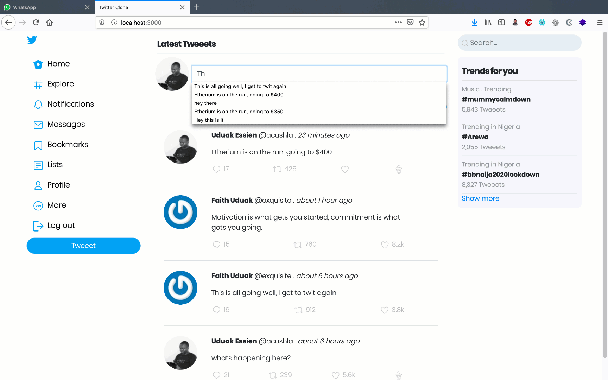

# Twitter App Clone

In this project I followed along [Andy Leverenz’s brilliant Building a Twitter Clone screen casts](https://youtu.be/5gUysPm64a4) to build a light weight version of Twitter in other to get lot of healthy experience using Devise in the process.

I totally revamped the UI, modelling it to the current interface of Twitter instead of the 2017 version he was using in the video. I used bootstrap while he used Bulma, since I was alot familiar with bootstrap.

I also implemented the Flash messages using Toastr instead of the built in flash.



## Built With

- Ruby on Rails
- Ruby
- Bootstrap

# Getting Started

To get a local copy of the repository please run the following commands on your terminal:

```
$ cd <folder>
```

~~~bash
$ git clone https://github.com/acushlakoncept/twitter-clone.git
$ cd twitter-clone
$ bundle install 
$ yarn install --check-files
~~~


# Author

👤 **Uduak Essien**

- Github: [@acushlakoncept](https://github.com/acushlakoncept/)
- Twitter: [@acushlakoncept](https://twitter.com/acushlakoncept)
- Linkedin: [acushlakoncept](https://www.linkedin.com/in/acushlakoncept/)


## 🤝 Contributing

Contributions, issues and feature requests are welcome!

## Show your support

Give a ⭐️ if you like this project!

## Acknowledgments

- The Odin Project
- Project inspired by Microverse Program